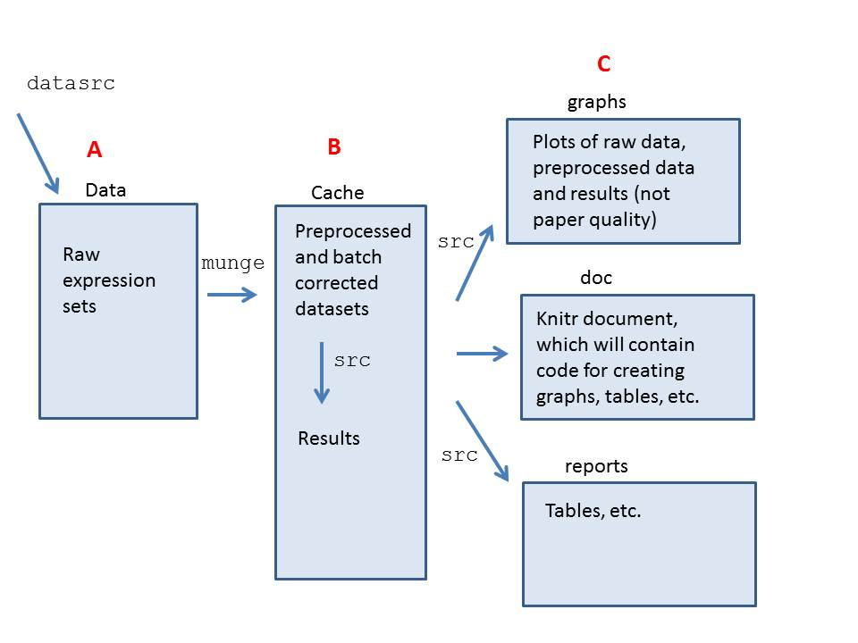

# Organizing the code and analysis:

The first step toward making a reproducible analysis is to organize the project code in a sensible way that will be easy for others to follow. Additionally, it is important to create code that can be run in batches or during non-interactive R sessions. I am going to present code organized using the R package `ProjectTemplate`. It allows for easy organization, loading and running of code.

The project architecture I use is diagrammed here. I will refer to starting points A, B and C.


In order to best organize code for a reproducible project, you must understand the purpose that a specific code chunk has in the broader project. Some pieces of code are for cleaning and preprocessing the data, some are for doing the statistical analysis, and some are for creating graphics. Code for different purposes will be stored in different directories.

## Column A

Because bioinformatics uses non-standard data formats with CEL files for microarrays, I create a new directory called “datasrc” that stores my code (both R code and unix commands) for obtaining the data (in this case from the Gene Expression Omnibus and directly from a collaborator) and creating an expression set. This code is only reproducible in an interactive session since it involes opening and closing R. Often I will integrate this datasrc code into a README.markdown file in the data directory that explains exactly how I obtained the code.

 I store the expression set I get from this process in the `data` directory. For reproducibility, I consider this data source to be the “primary” data source. If someone wants to go back to GEO, that is fine and the code is provided in the `datasrc` or README file. But for reproducibility purposes, if someone wants to reproduce my project, this expression set of the raw data is the easiest starting point, since the entire analysis from this point forward is performed in R. Starting with munging would be starting at point A in the diagram. 

Now that the raw data has been stored, the next step is to preprocess it. All of the preprocessing code is stored in the `munge` directory (munge is a term for data obtaining and data cleaning). At the end of munging the data, the new preprocessed objects are cached to the `cache` directory, where they can be loaded for further analysis. The benefit of organizing the preprocessing steps this way is two-fold. First, once they are completed and the preprocessed datasets are cached, you do not need to re-run the (often time-consuming) munging step and can instead start the analysis with the cached datasets (point B in the diagram). Second, in the ProjectTemplate `config` file, you can easily toggle between having the munging step on or off. That way, if you want to rerun the analysis from scratch, you can do so. But, most of the time you will want to start from these cached datasets instead.

In addition to the expression set, you may have a file containing annotation information (many common file formats are loaded automatically by ProjectTemplate if they are in the `data` diretory). It's a good idea to cache smaller files so that you can load them without also loading the large raw dataset.

The config file will likely look like this during this portion of the analysis (i.e. starting from point A):
    data_loading: on
    cache_loading: off
    munging: on

## Column B
After this, the bulk of the “research” code goes into the `src` directory. This is where you place all of your code for discovering things from the data. However, a useful step at this point is to create helper functions. Ideally, code in the `src` directory would mostly be calling functions that are either from pacakges, or stored in the `lib` directory. All the contents of the `lib` directory are loaded to your R worksplace when you load the project. This will help keep your `src` code clean and easy to follow.

The config file will likely look like this during this portion of the analysis (i.e. starting from point B):
    data_loading: off
    cache_loading: on
    munging: off

## Column C
Finally, an important part of this process is creating a reproducible document -- likely a journal article. This can be accomplished using the R package `knitr`, which creates dynamic reports that evaluate R code in order to produce the graphics/tables therein. The document is put in the `doc` directory, and knit from there. The majority of the R code evaluated within the knit document should be creating graphs and tables from the cached results that were produced in column B in the diagram. Because this code evaluates quickly, this allows for the knitting process to be fast (note that unless you are creating graphs of the raw data, you should turn off data loading to expediate the knitting process). Without cached results, knitting genomic analyses would be impossible due to the time it takes to run an individual analysis.

The config file should look like this while creating and knitting the document (i.e. starting from point B):
    data_loading: off
    cache_loading: on
    munging: off
	
With the config file like that, the user needs simply run

```{r, eval=FALSE}
library(knitr)
knit(paper.Rnw)
```

and the fully reproducible paper is created.

## General Project Notes
Finally, when possible, it is best to put the entire project on to GitHub. If you have very large data files (in this case I have the CEL files) it's a good idea to use the .gitignore file. Add to the file the directories you want to ignore. For files that 

Ideally, when this system is working, the reproduction of a paper is almost effortless. If someone wants to play around with your data and results, they need simply clone the project to their comptuer. Then, they just open an R session, set the working directory to the home directory of the cloned project, and run 

```{r, eval=FALSE}
library(ProjectTemplate)
load.project()
```
	
with the appropriate config file.


# This Analysis
First I load the data (obtained from a collaborator -- reading in the CEL files is in the `datasrc` directory).

```{r setup1, eval=FALSE}
library(ProjectTemplate)
load.project()
```

```{r setup2, include=FALSE}
library(ProjectTemplate)
load.project()
```

## Preprocessing 
An important first step in any microarray analysis is preprocessing. I strongly encourage you to use fRMA for several reasons. It quantile-normalized across an established and curated database of several thousand arrays. Other preprocessing techniques generally use only the arrays within the study. Besides the robustness of this, there is also a practical advantage for this for our purposes. In this workflow of building and validating a predictor, we will separate datasets into build and test sets several times. By using fRMA preprocessing, no matter how we subset the data, it will always be preprocessed the same (because of the fact that it uses the established database, rather than the specific study, to do the quantile-normalization). Therefore, this greatly reduces both the computational time and the confusion for preprocessing data. It can simply be preprocessed during the munging process. If you chose to use a preprocessing technique other than fRMA, you will need to preprocess your data every time you create a training or test set (and thus remove the preprocessing step from the `munge` directory and integrate it into the `src` code every time you create a subset of the data).

The code for preprocessing the data using frma is quite simple:

```{r, eval=FALSE}
frma.chung <- frma(dat.chung)
```

## Motivating Batch Correction

Sometimes it is difficult to figure out which biological variables you should treat as batch variables, and which you should not. For example, in this dataset there are several variables that could be important. When you have a dataset with rich annotation data, a multi-faceted approach is appropriate.

First, we chose to ignore variables that we had reason to believe would be so biologically different from other samples that they would only confuse, rather than help, the analysis. These samples were removed during the `munge` phase and aren't present in the cached preprocessed datasets. In this head and neck cancer set, we removed blood samples and normal non-cancer samples.

After this, though, we had several variables remaining. Amplification kit, procurement kit, etc. At this stage, some data visualization can be very helpful. 

I am borrowing a plot from Karl Broman -- essentially, this is a way to summarize the data quickly, in a way that lends itself to seeing relationship between items. This graphic simply connects the quantiles of each sample (along the x-axis). It is equivalent to looking at many boxplots next to each other.

(Side note -- RColorBrewer is a great way to get nice colors for your figures)
```{r colorbrewer}
cols <- brewer.pal(8, "Reds")
cols<-rev(cols)
```

I first looked at the data without any batch correction:

```{r frmaonly}
manyboxplot(frma.chung,dotcol=cols[1],linecol=cols[2:4],vlines=c(34.5,54.5),main="fRMA only")
```

When you look at the boxplots, it becomes clear that there is a more highly-variable portion of data. This perfectly corresponds with data that were procured from FFPE samples, rather than frozen samples (cutoffs for these samples are indicated with the white vertical lines). So correcting for this is a great idea, this is a natural selection for batch.

The ComBat function is great for correcting for batch with a known batch variable like this one.

```{r, eval=FALSE}
mod <- matrix(nrow=length(as.factor(info.chung$HPV.Stat)),ncol=1,as.factor(info.chung$HPV.Stat))
combat.frma.chung <- sva::ComBat(frma.chung,info.chung$Procurement,mod)

#store results
ProjectTemplate::cache('combat.frma.chung')
```

Now that we've created the Combat-corrected dataset, we can examine the boxplots to see if they have improved.

```{r combatonly}
manyboxplot(combat.frma.chung,dotcol=cols[1],linecol=cols[2:4],vlines=c(34.5,54.5),main="ComBat")
```

We can compare this to what would happen just using SVA.

```{r, eval=FALSE}
mod <- model.matrix(~as.factor(info.chung$HPV.Stat))
sv <- sva(frma.chung,mod)
modSv <- cbind(mod, sv$sv)
nmod <- dim(mod)[2]
gammahat <- (frma.chung %*% modSv %*% solve(t(modSv) %*% modSv))[, (nmod +
        1):(nmod + sv$n.sv)]

# remove batch effects from data
sva.frma.chung <- frma.chung - gammahat %*% t(sv$sv)

# store results
ProjectTemplate::cache('sva.frma.chung')
```

Here are the SVA plots

```{r svaonly}
manyboxplot(sva.frma.chung,dotcol=cols[1],linecol=cols[2:4],vlines=c(34.5,54.5),main="SVA")
```

Finally here they are in conjunction

```{r, eval=FALSE}
# SVA correction after ComBat(HPV outcome) #
mod <- model.matrix(~as.factor(info.chung$HPV.Stat))
sv <- sva(combat.frma.chung,mod)
modSv <- cbind(mod, sv$sv)
nmod <- dim(mod)[2]
gammahat <- (combat.frma.chung %*% modSv %*% solve(t(modSv) %*% modSv))[, (nmod +
        1):(nmod + sv$n.sv)]
sva.combat.frma.chung <- combat.frma.chung - gammahat %*% t(sv$sv)
ProjectTemplate::cache('sva.combat.frma.chung')
```

Here are the SVA-Combat plots

```{r svacombat}
manyboxplot(sva.combat.frma.chung,dotcol=cols[1],linecol=cols[2:4],vlines=c(34.5,54.5),main="SVA + ComBat")
```


## Prediction
Being able to predict an outcome of interest in a new sample is a major reason why we research genetic diseases. In this case, the outcome we care about is the HPV status. There were six samples in this case that did not have a reported HPV status. Below I will walk through how to build a predictor in order to identify the HPV status for these six samples.

Above we gave motivation for why batch correction helped normalize the expression levels in different arrays. Now we'd like to convince you that this batch correction will help in prediction problems.


Now, in our case we had six samples that had no information as to their HPV statuses. Below is a table showing the predictions.

```{r predictions, results='asis'}
print(xtable(predictions_fSVA), type='html')
```
