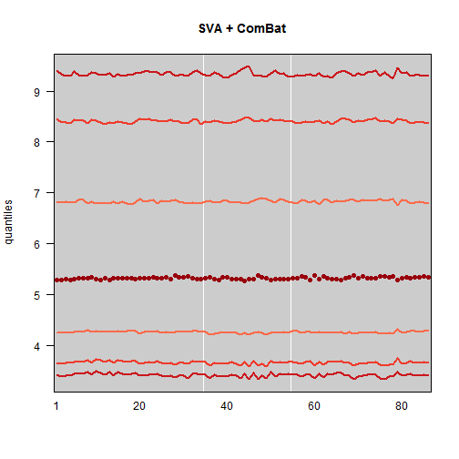

# Introduction

The development of high-throughput biological experiments has been one of the great developments in modern biology. However, with this development comes a new set of challenges when analyzing the data of these experiments. The introduction of unwanted variation and noise in the data has been well-documented. These problems, referred to as batch effects, can alter not only standard expression analysis, but also any genomic prediction done with these samples. Several methods have been developed to address batch effects in genomic data, including ComBat, SVA and fSVA. However, there have been few efforts to develop a standard workflow for biologists and statisticians wanting to implement these methods while following best practices for a reproducible analysis.

The purpose of this paper is to provide a workflow to create and validate a predictor for a high-throughput genomic dataset. This workflow ensures the proper treatment of batch effects, while making the analysis reproducible, all using the statistical software R. We will examine a large dataset of head and neck squamous cell carcinoma, which has been collected by a collaborator. By following the workflow outlined in this paper, other researchers wanting to create a predictor from a genomic dataset can do so in a reproducible and reliable way that accounts for most of the unwanted variation in the dataset.

# Organizing the code and analysis:

The first step toward making a reproducible analysis is to organize the project code in a sensible way that will be easy for others to follow. Additionally, it is important to create code that can be run in batches or during non-interactive R sessions. I am going to present code organized using the R package `ProjectTemplate`. It allows for easy organization, loading and running of code.

The project architecture I use is diagrammed here. I will refer to starting points A, B and C.


In order to best organize code for a reproducible project, you must understand the purpose that a specific code chunk has in the broader project. Some pieces of code are for cleaning and preprocessing the data, some are for doing the statistical analysis, and some are for creating graphics. Code for different purposes will be stored in different directories.

## Column A

Because bioinformatics uses non-standard data formats with CEL files for microarrays, I create a new directory called “datasrc” that stores my code (both R code and unix commands) for obtaining the data (in this case from the Gene Expression Omnibus and directly from a collaborator) and creating an expression set. This code is only reproducible in an interactive session since it involes opening and closing R. Often I will integrate this datasrc code into a README.markdown file in the data directory that explains exactly how I obtained the code.

 I store the expression set I get from this process in the `data` directory. For reproducibility, I consider this data source to be the “primary” data source. If someone wants to go back to GEO, that is fine and the code is provided in the `datasrc` or README file. But for reproducibility purposes, if someone wants to reproduce my project, this expression set of the raw data is the easiest starting point, since the entire analysis from this point forward is performed in R. Starting with munging would be starting at point A in the diagram. 

Now that the raw data has been stored, the next step is to preprocess it. All of the preprocessing code is stored in the `munge` directory (munge is a term for data obtaining and data cleaning). At the end of munging the data, the new preprocessed objects are cached to the `cache` directory, where they can be loaded for further analysis. The benefit of organizing the preprocessing steps this way is two-fold. First, once they are completed and the preprocessed datasets are cached, you do not need to re-run the (often time-consuming) munging step and can instead start the analysis with the cached datasets (point B in the diagram). Second, in the ProjectTemplate `config` file, you can easily toggle between having the munging step on or off. That way, if you want to rerun the analysis from scratch, you can do so. But, most of the time you will want to start from these cached datasets instead.

In addition to the expression set, you may have a file containing annotation information (many common file formats are loaded automatically by ProjectTemplate if they are in the `data` diretory). It's a good idea to cache smaller files so that you can load them without also loading the large raw dataset.

The config file will likely look like this during this portion of the analysis (i.e. starting from point A):
    data_loading: on
    cache_loading: off
    munging: on

## Column B
After this, the bulk of the “research” code goes into the `src` directory. This is where you place all of your code for discovering things from the data. However, a useful step at this point is to create helper functions. Ideally, code in the `src` directory would mostly be calling functions that are either from pacakges, or stored in the `lib` directory. All the contents of the `lib` directory are loaded to your R worksplace when you load the project. This will help keep your `src` code clean and easy to follow.

The config file will likely look like this during this portion of the analysis (i.e. starting from point B):
    data_loading: off
    cache_loading: on
    munging: off

## Column C
Finally, an important part of this process is creating a reproducible document -- likely a journal article. This can be accomplished using the R package `knitr`, which creates dynamic reports that evaluate R code in order to produce the graphics/tables therein. The document is put in the `doc` directory, and knit from there. The majority of the R code evaluated within the knit document should be creating graphs and tables from the cached results that were produced in column B in the diagram. Because this code evaluates quickly, this allows for the knitting process to be fast (note that unless you are creating graphs of the raw data, you should turn off data loading to expediate the knitting process). Without cached results, knitting genomic analyses would be impossible due to the time it takes to run an individual analysis.

The config file should look like this while creating and knitting the document (i.e. starting from point B):
    data_loading: off
    cache_loading: on
    munging: off
	
With the config file like that, the user needs simply run


```r
library(knitr)
knit(paper.Rnw)
```


and the fully reproducible paper is created.

## General Project Notes
Finally, when possible, it is best to put the entire project on to GitHub. If you have very large data files (in this case I have the CEL files) it's a good idea to use the .gitignore file. Add to the file the directories you want to ignore. For files that 

Ideally, when this system is working, the reproduction of a paper is almost effortless. If someone wants to play around with your data and results, they need simply clone the project to their comptuer. Then, they just open an R session, set the working directory to the home directory of the cloned project, and run 


```r
library(ProjectTemplate)
load.project()
```

	
with the appropriate config file.


# This Analysis
First I load the data (obtained from a collaborator -- reading in the CEL files is in the `datasrc` directory).


```r
library(ProjectTemplate)
load.project()
```


## Preprocessing 
An important first step in any microarray analysis is preprocessing. I strongly encourage you to use fRMA for several reasons. It quantile-normalized across an established and curated database of several thousand arrays. Other preprocessing techniques generally use only the arrays within the study. Besides the robustness of this, there is also a practical advantage for this for our purposes. In this workflow of building and validating a predictor, we will separate datasets into build and test sets several times. By using fRMA preprocessing, no matter how we subset the data, it will always be preprocessed the same (because of the fact that it uses the established database, rather than the specific study, to do the quantile-normalization). Therefore, this greatly reduces both the computational time and the confusion for preprocessing data. It can simply be preprocessed during the munging process. If you chose to use a preprocessing technique other than fRMA, you will need to preprocess your data every time you create a training or test set (and thus remove the preprocessing step from the `munge` directory and integrate it into the `src` code every time you create a subset of the data).

The code for preprocessing the data using frma is quite simple:


```r
frma.chung <- frma(dat.chung)
```


## Motivating Batch Correction

Sometimes it is difficult to figure out which biological variables you should treat as batch variables, and which you should not. For example, in this dataset there are several variables that could be important. When you have a dataset with rich annotation data, a multi-faceted approach is appropriate.

First, we chose to ignore variables that we had reason to believe would be so biologically different from other samples that they would only confuse, rather than help, the analysis. These samples were removed during the `munge` phase and aren't present in the cached preprocessed datasets. In this head and neck cancer set, we removed blood samples and normal non-cancer samples.

After this, though, we had several variables remaining. Amplification kit, procurement kit, etc. At this stage, some data visualization can be very helpful. 

I am borrowing a plot from Karl Broman -- essentially, this is a way to summarize the data quickly, in a way that lends itself to seeing relationship between items. This graphic simply connects the quantiles of each sample (along the x-axis). It is equivalent to looking at many boxplots next to each other.

(Side note -- RColorBrewer is a great way to get nice colors for your figures)

```r
cols <- brewer.pal(8, "Reds")
cols <- rev(cols)
```


I first looked at the data without any batch correction:


```r
manyboxplot(frma.chung, dotcol = cols[1], linecol = cols[2:4], vlines = c(34.5, 
    54.5), main = "fRMA only")
```

 


When you look at the boxplots, it becomes clear that there is a more highly-variable portion of data. This perfectly corresponds with data that were procured from FFPE samples, rather than frozen samples (cutoffs for these samples are indicated with the white vertical lines). So correcting for this is a great idea, this is a natural selection for batch.

The ComBat function is great for correcting for batch with a known batch variable like this one.


```r
mod <- matrix(nrow = length(as.factor(info.chung$HPV.Stat)), ncol = 1, as.factor(info.chung$HPV.Stat))
combat.frma.chung <- sva::ComBat(frma.chung, info.chung$Procurement, mod)

# store results
ProjectTemplate::cache("combat.frma.chung")
```


Now that we've created the Combat-corrected dataset, we can examine the boxplots to see if they have improved.


```r
manyboxplot(combat.frma.chung, dotcol = cols[1], linecol = cols[2:4], vlines = c(34.5, 
    54.5), main = "ComBat")
```

 


We can compare this to what would happen just using SVA.


```r
mod <- model.matrix(~as.factor(info.chung$HPV.Stat))
sv <- sva(frma.chung, mod)
modSv <- cbind(mod, sv$sv)
nmod <- dim(mod)[2]
gammahat <- (frma.chung %*% modSv %*% solve(t(modSv) %*% modSv))[, (nmod + 1):(nmod + 
    sv$n.sv)]

# remove batch effects from data
sva.frma.chung <- frma.chung - gammahat %*% t(sv$sv)

# store results
ProjectTemplate::cache("sva.frma.chung")
```


Here are the SVA plots


```r
manyboxplot(sva.frma.chung, dotcol = cols[1], linecol = cols[2:4], vlines = c(34.5, 
    54.5), main = "SVA")
```

 


Finally here they are in conjunction


```r
# SVA correction after ComBat(HPV outcome) #
mod <- model.matrix(~as.factor(info.chung$HPV.Stat))
sv <- sva(combat.frma.chung, mod)
modSv <- cbind(mod, sv$sv)
nmod <- dim(mod)[2]
gammahat <- (combat.frma.chung %*% modSv %*% solve(t(modSv) %*% modSv))[, (nmod + 
    1):(nmod + sv$n.sv)]
sva.combat.frma.chung <- combat.frma.chung - gammahat %*% t(sv$sv)
ProjectTemplate::cache("sva.combat.frma.chung")
```


Here are the SVA-Combat plots


```r
manyboxplot(sva.combat.frma.chung, dotcol = cols[1], linecol = cols[2:4], vlines = c(34.5, 
    54.5), main = "SVA + ComBat")
```

 


## Gene Set Enrichment Analysis 
Frequently in an analysis of a new dataset, you might have previous knowledge about the condition you are studying. In this case, there has been previous research on head and neck cancer, as well as the role that HPV has on the gene expression of these cancers. Indeed, the fact that head and neck cancer is so heterogeneous is why we chose to study it further. I will perform a general gene set enrichment analysis, as well as look at one specific gene that is known to be highly correlated with HPV in head and neck cancer. By doing this analysis, I can verify that batch correction is helping with these expression analyses. Previous research suggests that it will, but it is always important to verify that the batch correction isn't introducing any errors into the analysis.

The first analysis I will perform is gene set analysis -- that is, comparing the differential expression levels between HPV positive and negative samples in my data, and compare these to expression levels of previous studies. The code for this analysis can be found in the `src` directory. I downloaded the reference gene sets from the Broad Institute -- code preprocessing this can be found in the `munge` folder. 

The general idea of gene set enrichment analysis is to compare the differential expression in your data between two different groups, and compare that differential expression to known gene sets that are correlation with different biological phenomena. The analysis will identify how closely the differential expression in your datasets correspond to the differential expression of other known comparison groups.

In this case I am interested in the differential expression between HPV positive and HPV negative samples. Below are the results for the gene sets that had the largest increase in differential expression for HPV positive samples compared to HPV negative samples, as well as the gene sets that had the largest decrease in diferential expression for HPV positive samples compared to HPV negative samples.


```r
print(xtable(tabgenesets), type = "html")
```

<!-- html table generated in R 3.0.0 by xtable 1.7-1 package -->
<!-- Mon May 06 14:16:38 2013 -->
<TABLE border=1>
<TR> <TH>  </TH> <TH> Up in HPV Positive </TH> <TH> Down in HPV Positive </TH>  </TR>
  <TR> <TD align="right"> No Correction </TD> <TD> PYEON_HPV_POSITIVE_TUMORS_UP </TD> <TD> REACTOME_EXTRACELLULAR_MATRIX_ORGANIZATION </TD> </TR>
  <TR> <TD align="right"> ComBat Only </TD> <TD> PYEON_HPV_POSITIVE_TUMORS_UP </TD> <TD> CROMER_TUMORIGENESIS_UP </TD> </TR>
  <TR> <TD align="right"> SVA Only </TD> <TD> SLEBOS_HEAD_AND_NECK_CANCER_WITH_HPV_UP </TD> <TD> LIANG_SILENCED_BY_METHYLATION_2 </TD> </TR>
  <TR> <TD align="right"> ComBat and SVA </TD> <TD> SLEBOS_HEAD_AND_NECK_CANCER_WITH_HPV_UP </TD> <TD> BROWNE_INTERFERON_RESPONSIVE_GENES </TD> </TR>
   </TABLE>


This analysis is reassuring. Both the uncorrected and corrected data correlate to previously studied head and neck cancer gene sets. Furthermore, the Pyeon dataset included head and neck cancer smaples, as well as cervical cancer samples. The Slebos dataset includes only head and neck cancer samples. Therefore, we have some indication that batch correction is helping (and is also not harming) the analysis. The genes that are most down-expressed in HPV positive samples compared to HPV negative samples may be related to the cancer, and would warrent further analysis.

## Specific Marker Evaluation
Often in an analysis, there is a specific gene or marker that you are interested in investigating further. In this case, p16 is an established marker for HPV positive tumors. It is present in nearly all the HPV positive tumors, but only present in 20% of HPV negative tumors. A known marker like this can be a helpful benchmark for ensuring that the batch correction method is not wiping out true differential expression in your dataset.

## Prediction
Above we gave motivation for why batch correction helped normalize the expression levels in different arrays. Now we'd like to convince you that this batch correction will help in prediction problems.

Being able to predict an outcome of interest in a new sample is a major reason why we research genetic diseases. In this case, the outcome we care about is the HPV status. There were seven samples in this case that did not have a reported HPV status. Below I will walk through how to build a predictor in order to identify the HPV status for these seven samples.

First, based on my previous research, I know that the level of correlation between the batch and the outcome can determine how much batch negatively impacts the performance of the predictor. While much of the variation in the data is due to unknown batches, I did find before that the prodcurement method was one of the most visible batches. Therefor I will look at the correlation between the procurement method and the HPV outcome.


```r
print(xtable(table(info.chung$Procurement, info.chung$HPV.Stat)), type = "html")
```

<!-- html table generated in R 3.0.0 by xtable 1.7-1 package -->
<!-- Mon May 06 14:16:38 2013 -->
<TABLE border=1>
<TR> <TH>  </TH> <TH> Neg </TH> <TH> Pos </TH>  </TR>
  <TR> <TD align="right"> FFPE </TD> <TD align="right">  16 </TD> <TD align="right">   4 </TD> </TR>
  <TR> <TD align="right"> Frozen </TD> <TD align="right">  42 </TD> <TD align="right">  24 </TD> </TR>
   </TABLE>


Because this is a moderate, but not extreme, level of correlation between the procurement method and the outcome, I only will expect a modest improvement in prediction accuracy in the steps that follow. However given that the correlation is not zero, and furthermore given that there are several other known and unknown variables contributing to the variance in this data, I think batch correction is still appropriate.

One most important steps that you should perform when doing a prediction problem is to cross-validate the accuracy of the predictor you want to use, in conjunction with the normalization and batch-correction techniques you will use. Looking at the distribution of the variances from before is helpful, but ultimately looking at the cross-validated accuracies gives you a more certain assessment of whether or not the batch-correction is indeed helping your data analysis. 

In this case, I am interested in predicting the HPV status of some unlabeled samples using prediction analysis of microarrays (PAM). In order to make sure the predictor is valid, and furthermore in order to assess whether or not the batch-correction techniques are improving the predictor, I will perform cross-validation in three different scenarios.


In this case I chose training and test sets that were the same size. This is not neceessary -- the most important thing is that the training/test set sizes are the same across the different conditions that you are examining. Otherwise, the different sample sizes will be an unwanted confounder in your analysis.

Below are the steps for buildling and validating a PAM predictor using cross-validation.

1. Batch-correct training set using ComBat and SVA.
2. Build PAM predictor on training set.
3. fSVA correct test set using the training set as the database.
4. Predict HPV status on this test set using predictor from step 2.
5. Calculate the percent accuracy of the predicted HPV statuses.
6. Repeat steps 1-5 100 times.

I chose to compare the performance of these predictors against two different null hypotheses. The first is the case that I do not use fSVA to correct the test set -- that is, the case where I remove step 3 from the process. The second is the case where I use neither fSVA nor batch correction on the training set -- that is, the case where I remove both steps 3 and 1 from the process. In order to make the most valid comparisons, for each iteration you should perform all three scenarios on the same training and testing sets. This way, you have "paired" data and can compare the results of each iteration directly.

In order to clarify the differences between the three steps that I performed, below are three figures showing the expression level boxplots for each of the conditions. These are the boxplots for just one iteration of the code (the first one). The code for this can be found in the `test` directory.

Below are the boxplots for the null case where no batch correction has been performed on the training and test sets:


Now, here is the null case where batch correction on the training set only has been performed.


And finally here is the test case where batch correction has been performed on both the training set and the test set.


Clearly the most unwanted variation in the data is removed when batch correcting both the training set and test set. 

Note that in the last graph, the data does not look quite as smooth as it did when we simply performed SVA on the entire data set in the "Motivating Batch Correction" section of this paper. That is to be expected -- when batch correction is performed using a smaller database (in this case 43 samples versus 86 samples), the method will detect less of the variation in the data. However, batch-correcting over the largest number of samples possible (in this case the 43 training set samples) and then fSVA correcting the remaining samples (in this case the 43 test set samples) will remove the most variation and is likely the best approach.

Now that we've visualized the data, we can look at the cross-validated prediction accuracies in order to asses how well each of the methods performs.

Below is a table of the average cross-validated prediction accuracy in the three groups.


```r
print(xtable(predictor_results$tabmeans), type = "html")
```

<!-- html table generated in R 3.0.0 by xtable 1.7-1 package -->
<!-- Mon May 06 14:16:38 2013 -->
<TABLE border=1>
<TR> <TH>  </TH> <TH> Average Prediction Accuracy </TH>  </TR>
  <TR> <TD align="right"> No Correction </TD> <TD align="right"> 0.78 </TD> </TR>
  <TR> <TD align="right"> Batch Correction on training set only </TD> <TD align="right"> 0.79 </TD> </TR>
  <TR> <TD align="right"> Batch Correction on training set and test set </TD> <TD align="right"> 0.80 </TD> </TR>
   </TABLE>


Below are boxplots of these improvements.


```r
cols <- brewer.pal(3, "Dark2")
pretty_boxplot(y = list(predictor_results$none.out, predictor_results$dbonly.out, 
    predictor_results$dbfsva.out), cols = cols, labs = c("No Correction", "Training Set Only", 
    "Training and Test Set"), main = "Cross-Validated Accuracies")
```

 


These results are consistent with what was previously found in Parker and Leek 2012. Because the level of confounding between the batches and the outcomes was relatively low, we did not expect to see a huge amount of improvement. However, we did expect to see a decrease in the variance of the cross-validated accuracies.

Based on these results, I feel confident in applying batch correction on both the database (using ComBat and SVA) as well as on the new samples (using fSVA). I have every reason to believe that batch correction will lead to the most accurate predictions.

Recall from before that I had seven unlabeled samples that I am interesting in classifying as HPV positive or HPV negative. In order to illustrate my point, I will predict the status of these seven samples after batch correction, and also before batch correction to see if there is a difference in the predicted outcomes.

I now will use my entire dataset of labeled HPV samples (n=86) as my training set. After batch-correcting this dataset, I will build a PAM predictor on it. Then, I will fSVA-correct the seven unlabeled samples (using the 86 labeled samples as the database).

I'll compare the results of this to the scenario where I don't batch correct the seven unlabeled samples, and where I don't batch correct either the seven unlabeled samples or the 86 samples in the dataset.

Below are the results of this analysis.


```r
res <- cbind(predictions_nofSVA[, 1], predictions_nofSVA[, 4], predictions_fSVA[, 
    4])
colnames(res) <- c(colnames(predictions_nofSVA)[c(1, 4)], colnames(predictions_fSVA)[4])
print(xtable(res), type = "html")
```

<!-- html table generated in R 3.0.0 by xtable 1.7-1 package -->
<!-- Mon May 06 14:16:39 2013 -->
<TABLE border=1>
<TR> <TH>  </TH> <TH> None </TH> <TH> ComBat+SVA </TH> <TH> ComBat+SVA+fSVA </TH>  </TR>
  <TR> <TD align="right"> 2004-04-22-CHC48-Chung-Human2.0-Rep1.CEL </TD> <TD> Neg </TD> <TD> Neg </TD> <TD> Neg </TD> </TR>
  <TR> <TD align="right"> 2004-04-23-CHC55-Chung-Human2.0-Rep1.CEL </TD> <TD> Neg </TD> <TD> Neg </TD> <TD> Neg </TD> </TR>
  <TR> <TD align="right"> 2005-10-26-345CC10-Chung-Human2.0-Rep1.CEL </TD> <TD> Neg </TD> <TD> Neg </TD> <TD> Pos </TD> </TR>
  <TR> <TD align="right"> 2006-01-30-345CC11-Chung-Human2.0-Rep1.CEL </TD> <TD> Neg </TD> <TD> Neg </TD> <TD> Pos </TD> </TR>
  <TR> <TD align="right"> 2006-01-30-345CC12-Chung-Human2.0-Rep1.CEL </TD> <TD> Neg </TD> <TD> Neg </TD> <TD> Neg </TD> </TR>
  <TR> <TD align="right"> 2006-07-11-39CC07-Chung-Human2.0-Rep1.CEL </TD> <TD> Neg </TD> <TD> Pos </TD> <TD> Pos </TD> </TR>
  <TR> <TD align="right"> 323CC164-20070829-Hu133.CEL </TD> <TD> Neg </TD> <TD> Neg </TD> <TD> Neg </TD> </TR>
   </TABLE>


## Discussion
In this paper we have provided a reproducible and reliable way to build a predictor while accounting for batch effects within the data.
